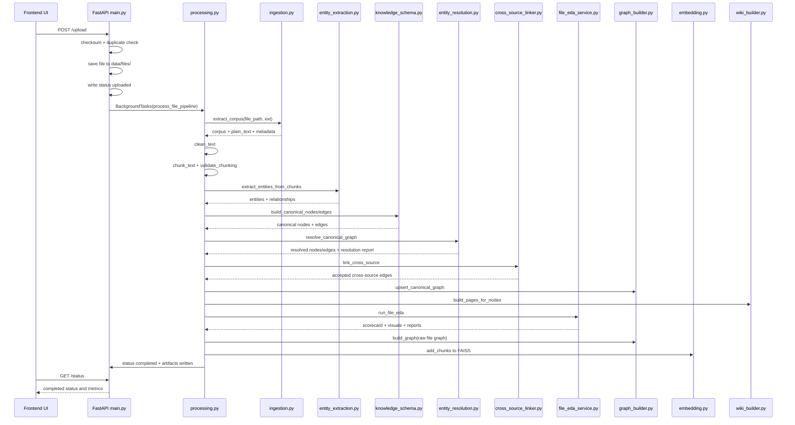

# KG Creation Process

## 1. Overall Architecture

This project builds a local, file-backed knowledge graph pipeline around FastAPI services, lightweight NLP extraction, canonical graph merging, FAISS-based vector retrieval, and a retrieval layer that combines wiki summaries, graph traversal, and semantic chunk search.

At a high level, the system has two ingestion branches:

1. Document branch: file upload or URL scrape goes through text extraction, chunking, entity and relationship extraction, canonicalization, EDA-based quality analysis, graph persistence, and FAISS indexing.
2. Database branch: database connection or SQL-folder materialization goes through schema introspection, profiling, EDA, Graphify extraction or fallback graph generation, canonical merge, and schema-text embedding.

The runtime architecture is local-first:

- API layer: FastAPI endpoints in `backend/main.py`
- Background orchestration: FastAPI `BackgroundTasks`
- File/document processing: `backend/processing.py`
- DB processing: `backend/db_processing.py`
- Canonical KG storage: JSON files under `backend/data/`
- Vector retrieval: FAISS index persisted under `backend/data/faiss/`
- Query orchestration: planner logic in `backend/main.py`, graph traversal in `backend/graph_builder.py`, LLM calls in `backend/llm_client.py`

There is no external graph database, vector database, workflow queue, or orchestration platform in the current implementation. Persistence is handled through local JSON files, FAISS artifacts, and status files.

### Major Modules And Services

| Stage | Primary modules | Responsibility |
|---|---|---|
| API and orchestration | `backend/main.py` | Entry points, status APIs, query planning, final response generation |
| File ingestion | `backend/processing.py`, `backend/ingestion.py` | Extract text/corpus, clean, chunk, extract entities/relations, build graphs, index chunks |
| DB ingestion | `backend/db_processing.py`, `backend/db_connector.py`, `backend/db_graphify.py` | Connect DB, introspect schema, profile data, graphify schema, merge into canonical KG |
| Extraction | `backend/entity_extraction.py` | Entity extraction and heuristic relationship extraction |
| Canonical schema | `backend/knowledge_schema.py` | Canonical node/edge IDs and schema validation |
| Deduplication and review | `backend/entity_resolution.py` | Merge, create, or queue manual review for canonical entities |
| Cross-source linking | `backend/cross_source_linker.py` | Connect DB-derived and document-derived entities with gated confidence logic |
| KG persistence and traversal | `backend/graph_builder.py` | Per-file graph persistence, canonical graph merge, graph retrieval, semantic traversal |
| Quality and confidence | `backend/file_eda_service.py`, `backend/confidence_scoring.py` | Confidence scoring, graph validation, scorecards, EDA artifacts |
| Retrieval index | `backend/embedding.py` | Sentence embeddings, FAISS persistence, semantic search |
| Wiki layer | `backend/wiki_builder.py` | Canonical wiki page generation for entity-centric summaries |
| Routing and generation | `backend/slm.py`, `backend/router.py`, `backend/llm_client.py` | SLM matching, model recommendation, LLM invocation |
| Observability | `backend/trace.py`, status JSON files | Query trace steps and pipeline status lifecycle |

### Component Interaction

The component flow is:

1. Frontend calls upload, scrape, DB connect, analyse, status, graph, or final-run APIs through `frontend/src/services/api.js`.
2. FastAPI persists an initial status record and schedules background processing for ingestion jobs.
3. Background workers update status JSON files as each pipeline stage completes.
4. File or DB pipelines write intermediate artifacts such as corpus JSON, schema/profile JSON, graph JSON, EDA reports, canonical graph updates, and FAISS chunks.
5. Query-time endpoints pull from three retrieval layers: canonical wiki pages, graph relations, and vector chunks.
6. The answer generation layer combines those retrieval outputs into a prompt and calls a configured LLM provider or a local/mock fallback.

## 2. Data Ingestion Flow

### Entry Points And APIs

The main ingestion endpoints are implemented in [backend/main.py](/home/neelam/AI-Orchestrator/backend/main.py):

- `/upload`: accepts uploaded files and queues file processing
- `/scrape`: fetches a web page, strips structural HTML, saves plain text, and queues file processing
- `/db/connect`: queues database ingestion
- `/db/test`: validates DB connectivity without running the full pipeline
- `/status` and `/status/{file_id}`: expose ingestion progress for both file and DB jobs
- `/db/status/{db_id}`: DB-specific status lookup
- `/retry/{file_id}`: reruns full processing or indexing only, depending on completed stages

### Supported Input Formats

The file ingestion adapter registry in [backend/ingestion.py](/home/neelam/AI-Orchestrator/backend/ingestion.py) supports:

- PDF via `pypdf`
- DOCX via `python-docx`
- TXT via plain text read
- CSV via `pandas.read_csv`
- XLSX and XLS via `pandas.read_excel`
- JSON via `json.load`, with table conversion for list-of-dict payloads

Additional supported source types:

- Web pages through `/scrape`
- Databases through `/db/connect`
- SQL folders through `source_sql_dir`, materialized into SQLite before profiling

What is not currently supported:

- Native OCR pipeline for image PDFs or scanned documents
- Live external API ingestion beyond webpage scraping
- Streaming ingestion queue or message broker integration

### File And URL Ingestion Lifecycle

For document ingestion:

1. The API reads file bytes or scraped text.
2. It computes a SHA-256 checksum.
3. It checks all existing status records for duplicates.
4. If `force=false` and a duplicate checksum exists, it returns HTTP 409.
5. If accepted, it writes the source to `data/files/{file_id}.{ext}`.
6. It writes `data/processed/{file_id}_status.json` with `status=uploaded`.
7. It schedules `process_file_pipeline(...)` as a FastAPI background task.

For web scraping specifically:

1. `requests` fetches the page.
2. `BeautifulSoup` removes `script`, `style`, `nav`, `footer`, and `header` tags.
3. The extracted text is saved as a `.txt` file under `data/files/`.
4. The rest of the pipeline is the same as a document file.

### Database Ingestion Lifecycle

For DB ingestion:

1. `/db/connect` receives engine and connection parameters.
2. A DB status file is initialized through `init_db_status(...)`.
3. `db_pipeline(...)` is scheduled in the background.
4. If `source_sql_dir` is present, SQL files are replayed into a generated SQLite DB.
5. SQLAlchemy connects to the DB.
6. Schema introspection, profiling, EDA, Graphify extraction, canonical merge, and embedding then run.

### Folder And File Structure Used During Ingestion

The effective storage layout is relative to the backend working directory:

- `data/files/`: raw uploaded files and scraped text files
- `data/processed/`: status files, corpus files, EDA reports, summaries, metrics, and review artifacts
- `data/graphs/`: per-file graph JSON snapshots
- `data/faiss/`: FAISS vector index and chunk metadata
- `data/canonical_graph.json`: merged canonical graph
- `data/canonical_registry.json`: canonical entity registry and merge/review state
- `data/slm_registry.json`: reusable SLM match registry
- `data/wiki_pages/`: canonical wiki pages and wiki index
- `data/db_schemas/`: schema export and Graphify output folders
- `data/db_data/`: materialized/generated database files

### Queue Or Background Processing

There is background processing, but it is minimal and process-local:

- Jobs are launched with FastAPI `BackgroundTasks`
- There is no Celery, Redis queue, RabbitMQ, Kafka, or distributed worker system
- Progress is tracked through JSON status files instead of a central job store
- The frontend polls `/status` every 2 seconds and `/status/{file_id}` about every 1.5 seconds in the detail modal

This is sufficient for a local demo workflow, but not robust for multi-worker production deployment.

## 3. Preprocessing And Cleaning

### Text Extraction Process

The text extraction contract is `extract_corpus(file_path, ext)` in [backend/ingestion.py](/home/neelam/AI-Orchestrator/backend/ingestion.py).

Instead of returning only raw text, it builds a structured corpus object:

- `source_type`
- `adapter`
- `plain_text`
- `text_blocks`
- `table_rows`
- `metadata`

This allows downstream logic to preserve whether content originated from paragraphs, pages, rows, or JSON records.

Format-specific extraction behavior:

- PDF: extracts page text into page-level blocks
- DOCX: extracts paragraph text into paragraph-level blocks
- CSV/Excel/JSON tables: converts structured rows into both row objects and flattened textual representations like `table X row Y: col=value`
- TXT: loads the full file as a single text block

If the primary adapter fails or yields empty text, the code falls back to a raw binary decode strategy using UTF-8 and then Latin-1.

### OCR Usage

There is no OCR pipeline in the current codebase.

Implications:

- Text-based PDFs work
- Scanned PDFs or image-heavy documents are likely to yield empty or low-quality text
- The pipeline will fail with `No text could be extracted` if no usable text is found

### Cleaning And Normalization

The `clean_text(...)` step in [backend/processing.py](/home/neelam/AI-Orchestrator/backend/processing.py) performs lightweight normalization:

- collapses excessive newlines
- collapses repeated spaces
- removes ASCII control characters
- trims surrounding whitespace

This is intentionally simple. There is no language-specific normalization, stemming, stopword removal, sentence repair, or advanced document layout normalization.

### Chunking Strategy

The `chunk_text(...)` implementation uses a word-window approach:

- chunk size: 400 words
- overlap: 60 words
- metadata per chunk:
  - `idx`
  - `text`
  - `start_word`
  - `end_word`
  - `word_count`

This design favors easy provenance tracking and local semantic search over token-accurate chunk boundaries.

### Chunk Validation

The system does not assume chunking is correct. It computes a validation report with:

- total words
- chunk count
- covered words
- coverage percentage
- overlap correctness percentage
- min/max overlap
- data loss detection flag

That report is persisted in status and processed artifacts. This is one of the stronger design choices in the pipeline because it turns chunking into a measurable stage rather than an opaque preprocessing step.

### Metadata Extraction

Metadata is extracted into a `corpus_profile` with:

- source type
- adapter used
- text block count
- table row count
- adapter-specific metadata such as page count, paragraph count, row count, or column list

## 4. NLP / AI Processing

### Entity Extraction Process

Entity extraction is implemented in [backend/entity_extraction.py](/home/neelam/AI-Orchestrator/backend/entity_extraction.py).

Primary path:

- spaCy `en_core_web_sm` if available

Fallback path:

- regex-based extraction for money values, dates, title-cased phrases, and uppercase terms

Each extracted entity is normalized into a shape with fields such as:

- `text`
- `label`
- `type`

When extracted per chunk, each entity also carries:

- `chunk_idx`
- `chunk_preview`
- optional `chunk_occurrences`

The chunk-level grounding is important because it creates a link from KG nodes back to the exact chunk region that produced them.

### Relationship Extraction Process

Relationships are extracted heuristically, not via a dedicated relation extraction model.

The algorithm:

1. Splits text into sentences.
2. Collects entities appearing in each sentence.
3. Creates pairwise relationships between nearby entity mentions.
4. Infers a relationship label from sentence keywords.

Current inferred relationship types include:

- `has_revenue`
- `employs`
- `owns`
- `located_in`
- `occurred_at`
- fallback `related_to`

This is simple and explainable, but it will generate noisy or generic edges in complex text.

### Embedding Generation

Embeddings are produced by [backend/embedding.py](/home/neelam/AI-Orchestrator/backend/embedding.py).

Primary embedding model:

- Sentence Transformers `all-MiniLM-L6-v2`

Fallback mode:

- deterministic hashed embedding generator when model loading or network access fails

Storage behavior:

- embeddings are inserted into a FAISS `IndexFlatIP`
- chunk metadata is persisted separately in `chunks.pkl`

The same semantic embedding strategy is reused in:

- vector retrieval
- canonical entity resolution scoring
- cross-source linking
- SLM matching
- semantic graph traversal

### Classification And Tagging Methods

The project has several lightweight classification layers rather than one central classifier:

- entity `type` mapping from spaCy labels
- relation label inference from lexical rules
- EDA confidence scoring for entities and relationships
- semantic consistency scoring
- SLM domain tagging based on prompt keywords
- model router complexity classification for prompts

### LLMs And NLP Models Used

Models and model families used in the project:

- spaCy `en_core_web_sm` for NER
- Sentence Transformers `all-MiniLM-L6-v2` for semantic embeddings
- Anthropic models via `anthropic`
- OpenAI chat models via `openai`
- Gemini via HTTP API
- Groq via OpenAI-compatible endpoint
- Ollama local models such as `llama3:8b`, `qwen2.5:7b`, `phi3:mini`

### Prompt Engineering Logic

Prompt construction happens in [backend/llm_client.py](/home/neelam/AI-Orchestrator/backend/llm_client.py).

The system prompt is concise and instructs the model to:

- act as an intelligent data analyst
- use document context and graph relations
- admit insufficiency when context is weak

The user prompt is composed from:

- document context from retrieved chunks
- graph relations rendered into a short graph text form
- the original question

At the orchestration level, [backend/main.py](/home/neelam/AI-Orchestrator/backend/main.py) also builds retrieval explainability and optionally wiki context before generation.

## 5. Knowledge Graph Creation

### How Nodes Are Generated

There are two graph layers.

#### Raw per-file graph

Built by `GraphBuilder.build_graph(...)` in [backend/graph_builder.py](/home/neelam/AI-Orchestrator/backend/graph_builder.py):

- nodes are created directly from extracted entities
- each node gets a local graph ID like `n0`, `n1`, `n2`
- node attributes include label, type, entity_type, confidence, chunk grounding metadata

#### Canonical graph

Built from canonical nodes produced in [backend/knowledge_schema.py](/home/neelam/AI-Orchestrator/backend/knowledge_schema.py):

- canonical IDs are stable hashes derived from `entity_type + normalized label`
- aliases are preserved
- provenance tracks source file and chunk references
- temporal placeholders exist even if not populated yet

### How Edges Are Generated

Three edge families exist:

1. Raw extracted relationships from document text
2. Canonical relationships derived from raw relationships and canonical entity mapping
3. Cross-source edges linking DB-derived and document-derived canonical nodes

DB ingestion can also generate edges from:

- Graphify output
- foreign key relationships
- implicit relationship detection fallback

### Schema Or Ontology Used

The schema is not a formal RDF/OWL ontology. It is a custom JSON graph schema.

Canonical node shape includes fields such as:

- `canonical_id`
- `label`
- `entity_type`
- `ner_label`
- `aliases`
- `confidence`
- `provenance`
- `first_seen_file_id`
- `temporal`

Canonical edge shape includes fields such as:

- `canonical_relation_id`
- `source_canonical_id`
- `target_canonical_id`
- `relation`
- `confidence`
- `provenance`
- `temporal`

This is a pragmatic canonical schema optimized for local persistence and retrieval, not standards interoperability.

### Entity Linking And Deduplication

Entity linking is handled in [backend/entity_resolution.py](/home/neelam/AI-Orchestrator/backend/entity_resolution.py).

Matching uses:

- normalized exact match
- lexical overlap via Jaccard
- embedding similarity
- type compatibility
- optional confidence hints

Thresholds:

- merge threshold: `0.72`
- manual review threshold: `0.58`

Decision outcomes:

- merge into existing canonical node
- create new canonical node
- create new canonical node and also append a pending review if similarity is borderline

This gives the system a lightweight human-in-the-loop path through `pending_reviews` in `canonical_registry.json`.

### Confidence Scoring

Confidence is implemented in [backend/confidence_scoring.py](/home/neelam/AI-Orchestrator/backend/confidence_scoring.py).

Entity confidence combines:

- mention frequency
- text length signal
- label/type signal
- duplicate penalties
- noisy-text penalties

Relationship confidence combines:

- relation prior
- context length signal
- source entity confidence
- target entity confidence
- duplicate penalties
- weak-pair penalties

The pipeline also produces aggregate quality metrics:

- `overall_kg_quality_score`
- `completeness_score`
- `consistency_score`
- `confidence_score`
- `graph_trust_score`
- `retrieval_readiness_score`

### EDA And Graph Quality Augmentation

`run_file_eda(...)` in [backend/file_eda_service.py](/home/neelam/AI-Orchestrator/backend/file_eda_service.py) enriches graph quality with:

- graph health metrics
- semantic consistency analysis
- relationship quality validation
- graph validation reports
- cross-file analytics
- PDF quality hints
- retry recommendations for low-confidence outputs

This EDA layer is one of the distinguishing features of the project because it tries to score graph trustworthiness rather than only building the graph.

## 6. Storage Layer

### Graph Database Used

No external graph database is used.

The KG is persisted as JSON files:

- per-source graph snapshots under `data/graphs/`
- canonical merged graph in `data/canonical_graph.json`

### Vector Database Used

No external vector database is used.

The vector storage layer is FAISS:

- `data/faiss/index.faiss`
- `data/faiss/chunks.pkl`

### Data Models And Schema

The system stores several logical data models:

- source status records
- source corpus representations
- raw graph snapshots
- canonical graph
- canonical entity registry and merge history
- wiki page documents
- vector chunk index
- DB schema/profile/accuracy summaries
- EDA scorecards and visualization metrics

### How Graph Data Is Persisted

Persistence happens incrementally during the pipeline:

1. Status file created at upload/connect time.
2. Corpus or schema/profile files saved after extraction/introspection.
3. Canonical artifacts saved after entity resolution.
4. Raw graph saved after graph construction.
5. Canonical graph updated through upsert logic.
6. Wiki pages regenerated for touched canonical nodes.
7. FAISS chunks appended and index re-written.

The persistence model is append/update on local files. There is no transactional boundary across all artifacts, so partial state is possible if a process dies mid-pipeline.

## 7. Retrieval And Query Layer

### Graph Querying Process

Graph querying is implemented through `GraphBuilder` methods in [backend/graph_builder.py](/home/neelam/AI-Orchestrator/backend/graph_builder.py):

- `get_graph(...)` for raw per-file graphs
- `get_canonical_graph(...)` for merged canonical graph
- `get_relations(...)` and `get_canonical_relations(...)` for lexical matching
- `get_relations_semantic(...)` and `get_canonical_relations_semantic(...)` for embedding-based node and relation traversal
- `get_graph_summary(...)` for analytical summaries

There is no Cypher, Gremlin, SPARQL, or graph query engine. Traversal is implemented in Python over in-memory JSON structures.

### GraphRAG Flow

The GraphRAG-style flow is orchestrated in [backend/main.py](/home/neelam/AI-Orchestrator/backend/main.py), mainly inside `/query` and `/final-run`.

The planner uses three retrieval layers:

1. Wiki-first lookup
2. Graph traversal with fallbacks
3. Vector chunk retrieval

The graph traversal fallback sequence is:

1. canonical semantic traversal
2. raw file semantic traversal
3. canonical lexical relation lookup
4. raw file lexical relation lookup

This is a hybrid GraphRAG strategy rather than pure vector RAG or pure graph reasoning.

### Semantic Search Integration

Semantic chunk retrieval uses FAISS and sentence embeddings.

Process:

1. Embed query text
2. Search FAISS for top-k chunks
3. Optionally filter by selected `file_ids`
4. Return scored chunk text and metadata

The number of chunks retrieved is controlled by the graph density routing profile.

### Hybrid Retrieval Methods

Hybrid retrieval combines:

- canonical wiki facts
- graph relations with relevance scoring
- semantic chunk search

Graph relevance scoring uses a mixture of:

- node semantic similarity
- lexical overlap with query tokens
- relation priors
- simple structural signals like node degree

### Query Routing Logic

The retrieval planner adapts based on graph density:

- sparse graph: `vector_weighted`
- medium density: `balanced`
- dense graph: `graph_weighted`

This directly affects:

- `chunk_k`
- number of graph nodes to score
- maximum relations to return

### SLM And Model Routing

Before final generation, the project can:

- match the prompt against an SLM registry using embeddings
- reuse, modify, or create an SLM record
- recommend a final generation model using prompt complexity, SLM score, context size, and graph density

This does not train a small model. It manages a registry of prompt-domain embeddings and metadata used to drive routing decisions.

### Explainability And Grounding

The query path computes:

- retrieval coverage percentage
- faithfulness percentage
- unsupported sentence samples
- retrieval explainability steps
- graph mode used
- wiki pages/facts used

This is valuable because it gives the system an internal quality signal for answer grounding, even though it is heuristic.

## 8. Technologies Used

### Technology Stack Summary

| Stage | Libraries / Frameworks | Models / Engines | Storage / Infra |
|---|---|---|---|
| API layer | FastAPI, Pydantic, aiofiles | None | Local process |
| File ingestion | pypdf, python-docx, pandas, json | None | Local filesystem |
| Web scraping | requests, BeautifulSoup | None | Local filesystem |
| DB access | SQLAlchemy, psycopg2, pymysql, sqlite3 | DB engine itself | PostgreSQL, MySQL, SQLite |
| NLP extraction | spaCy, regex | `en_core_web_sm` | In-memory + JSON artifacts |
| Embeddings | sentence-transformers, numpy | `all-MiniLM-L6-v2` | FAISS |
| Vector retrieval | faiss | inner-product similarity | `index.faiss`, `chunks.pkl` |
| Graph construction | custom Python | heuristic scoring | JSON graph files |
| Canonical resolution | numpy, custom scoring | embedding similarity | `canonical_registry.json` |
| DB graphification | Graphify CLI | external Graphify backend | schema files + graph JSON |
| LLM generation | anthropic, openai, httpx, Ollama, Groq API | Claude, GPT, Gemini, local Ollama models | provider APIs / local Ollama |
| Observability | logging, status JSON, trace engine | None | local JSON files |

### Orchestration Tools

Current orchestration is intentionally lightweight:

- FastAPI `BackgroundTasks`
- JSON file status updates
- frontend polling

Not present today:

- Celery
- Airflow
- Prefect
- Temporal
- Redis-backed queues

## 9. File-Level Code Explanation

### `backend/main.py`

This is the control tower.

Responsibilities:

- defines all API endpoints
- creates singleton services like `EmbeddingStore`, `GraphBuilder`, `SLMRegistry`, and `WikiBuilder`
- schedules background jobs for ingestion
- exposes status, graph, wiki, and analytics endpoints
- orchestrates query-time GraphRAG and final response generation

Why it matters:

- it is thin in some areas, but it still contains important planning logic for retrieval and final answer assembly

### `backend/processing.py`

This is the document ingestion pipeline.

Responsibilities:

- cleans text
- chunks text
- validates chunk coverage
- extracts entities and relationships
- canonicalizes and resolves entities
- runs file EDA and quality scoring
- builds per-file graph snapshots
- indexes chunks into FAISS
- maintains status JSON files

It is the main owner of the end-to-end file KG lifecycle.

### `backend/ingestion.py`

This module abstracts heterogeneous inputs into one corpus representation.

Responsibilities:

- format adapter registry
- extraction for PDF, DOCX, TXT, CSV, Excel, JSON
- fallback raw decoding
- generation of structured `text_blocks`, `table_rows`, and metadata

This is the boundary between raw source formats and the normalized KG pipeline.

### `backend/db_processing.py`

This is the DB ingestion orchestration layer.

Responsibilities:

- initialize DB job status
- connect to DB or build SQLite from SQL files
- introspect schema
- run profiling and implicit relationship detection
- run EDA before graph confidence decisions
- export DDL and invoke Graphify
- fall back to deterministic schema graph generation if Graphify yields nothing
- merge results into the canonical graph
- embed schema text into FAISS

It is effectively a second ingestion pipeline specialized for structured data.

### `backend/db_connector.py`

This is the database access abstraction.

Responsibilities:

- build SQLAlchemy engines for PostgreSQL, MySQL, or SQLite
- perform connectivity checks
- introspect tables, columns, foreign keys, and indexes
- export DDL files
- flatten schema metadata into a retrieval corpus string

### `backend/db_graphify.py`

This module bridges Graphify output into the project’s internal canonical graph model.

Responsibilities:

- invoke Graphify CLI
- locate `graph.json`
- parse graph output
- map Graphify nodes/edges into canonical nodes/edges
- merge mapped results into the canonical graph
- create DB-scoped raw graph snapshots for existing `/graph` endpoints

### `backend/graph_builder.py`

This is the graph persistence and traversal engine.

Responsibilities:

- build raw graph snapshots from extracted entities/relations
- upsert canonical nodes and edges
- suppress and restore canonical relations
- return raw or canonical graphs for APIs
- compute graph summary metrics
- perform lexical and semantic graph traversal at query time

### `backend/entity_extraction.py`

This is the extraction engine for documents.

Responsibilities:

- NER via spaCy if available
- regex fallback extraction
- heuristic relationship generation
- per-chunk provenance attachment

### `backend/knowledge_schema.py`

This defines the canonical graph data contract.

Responsibilities:

- canonical entity IDs
- canonical relation IDs
- canonical node builder
- canonical edge builder
- canonical graph validation

### `backend/entity_resolution.py`

This is the deduplication and merge-review layer.

Responsibilities:

- compare incoming canonical nodes to registry nodes
- compute similarity and compatibility scores
- merge, create, or queue human review
- persist merge history and pending reviews

### `backend/cross_source_linker.py`

This module connects structured and unstructured knowledge.

Responsibilities:

- compare source nodes against opposite-source canonical nodes
- gate candidates by lexical, semantic, and embedding thresholds
- boost scores with DB relationship evidence
- accept, reject, or queue review candidates
- persist cross-link artifacts and review backlog

### `backend/embedding.py`

This is the semantic indexing layer.

Responsibilities:

- load sentence transformer model or fallback embedder
- create and persist FAISS index
- add chunks for documents or schema text
- run semantic nearest-neighbor search

### `backend/file_eda_service.py`

This is the KG quality analytics layer.

Responsibilities:

- compute scored entities and relationships
- validate graph quality and semantic consistency
- emit scorecards and visual metrics
- generate reprocess hooks when confidence is low

### `backend/slm.py`

This is a routing registry, not a training pipeline.

Responsibilities:

- embed prompt text
- match against prior prompt/domain records
- reuse, modify, or create SLM entries
- scope decisions to selected `file_ids`

### `backend/router.py`

This ranks candidate final-generation models.

Responsibilities:

- classify prompt complexity
- score models using cost, speed, reasoning strength, SLM score, and graph density

### `backend/llm_client.py`

This is the generation backend.

Responsibilities:

- choose provider/model availability
- call Anthropic, OpenAI, Gemini, Groq, or Ollama
- fall back to a mock response when providers are unavailable

Important caveat:

- the file appears structurally fragile and contains malformed sections, so it should be treated as an architectural risk area

### `backend/wiki_builder.py`

This builds a local wiki layer over canonical entities.

Responsibilities:

- create entity-centric pages from canonical nodes and edges
- compile key facts, timeline edges, related entities, and citations
- maintain a wiki index for search and retrieval

### `backend/trace.py`

This tracks final-run query execution.

Responsibilities:

- start trace
- append timed steps
- finish trace with total runtime

### Frontend Modules

Important frontend files:

- `frontend/src/services/api.js`: centralizes backend API calls
- `frontend/src/store/index.js`: holds ingestion and run state
- `frontend/src/pages/InjectPage.jsx`: polls status and shows pipeline progress
- `frontend/src/pages/inject/UploadSurface.jsx`: triggers upload and scrape workflows
- `frontend/src/pages/inject/DirectUpload.jsx`: triggers DB test and DB ingestion workflows

The frontend does not run KG construction. It mainly acts as a thin control surface and status dashboard.

## 10. Sequence Diagram / Flow

### End-To-End Execution Flow For One Uploaded Document

### Step-By-Step Lifecycle Of One Uploaded Document

1. User uploads a file.
2. API computes checksum and prevents accidental duplicate ingestion.
3. Source file is persisted to `data/files/`.
4. Initial status record is created in `data/processed/`.
5. Background task extracts a normalized corpus.
6. Plain text is cleaned.
7. Text is chunked and overlap coverage is validated.
8. Entities and relationships are extracted per chunk.
9. Canonical node and edge candidates are built.
10. Canonical resolution merges or creates graph entities.
11. Cross-source linker attempts to connect the file graph to DB-derived entities.
12. Canonical graph JSON is updated.
13. Canonical wiki pages are regenerated for touched nodes.
14. EDA and confidence scoring run.
15. A raw per-file graph snapshot is written.
16. Chunks are embedded and added to FAISS.
17. Final status is marked `completed` and downstream retrieval becomes possible.

### Step-By-Step Lifecycle Of One DB Ingestion Run

1. User submits DB connection details or a SQL folder.
2. Status record is created with `queued`.
3. If a SQL folder is used, SQL is materialized into a generated SQLite DB.
4. SQLAlchemy connects and validates connectivity.
5. Schema introspection captures tables, columns, keys, indexes, and row counts.
6. Profiling computes semantic column hints and implicit relationships.
7. EDA runs before graph-confidence decisions.
8. Data dictionary entries are upserted from the profile.
9. DDL files are exported.
10. Graphify runs over exported schema files.
11. If Graphify returns nothing, a fallback graph is built from schema structure and implicit links.
12. Graphify/fallback output is mapped to canonical nodes and edges.
13. Cross-source linking attempts to connect DB entities with document-derived entities.
14. Canonical graph JSON is updated.
15. A DB-scoped raw graph snapshot is written so existing graph endpoints can render DB outputs.
16. Schema text is embedded into FAISS for retrieval.
17. Accuracy, trust, and summary artifacts are written.
18. Status is marked `completed`.

### Data Transformations At Each Stage

| Stage | Input | Output |
|---|---|---|
| Upload | file bytes / URL text / DB connection | status record + saved source |
| Extraction | raw source | normalized corpus or schema metadata |
| Cleaning | plain text | normalized plain text |
| Chunking | cleaned text | chunk list + chunk validation report |
| Extraction | chunks | entities + relationships |
| Canonicalization | entities + relationships | canonical nodes + edges |
| Resolution | canonical candidates | merged/resolved canonical nodes + review records |
| Graph build | resolved or optimized entities/relations | raw graph JSON + canonical graph update |
| Quality analysis | extracted graph + corpus metadata | scorecards, validation reports, recommendations |
| Indexing | chunks or schema text | FAISS vectors + chunk metadata |
| Query-time retrieval | prompt + optional file_ids | wiki facts + graph relations + semantic chunks |
| Generation | retrieval bundle | answer + trace + explainability metrics |

## 11. Error Handling And Monitoring

### Failure Handling

Failure handling is mostly stage-local:

- file pipeline wraps the full job in a `try/except` and writes `status=failed`
- DB pipeline wraps the job in `try/except` and writes `status=failed`
- file EDA failure is non-blocking and only downgrades outputs
- cross-source linking failure is non-blocking and logged as warning
- Graphify failure can fall back to deterministic schema graph construction
- embedding model failure falls back to deterministic local embeddings
- LLM provider failure falls back across providers and eventually to a mock answer

### Retry Logic

Current retry mechanisms:

- `/retry/{file_id}` for file jobs
- re-index only retry if graph stage already completed
- provider fallback for LLMs
- embedding fallback if SentenceTransformer load fails
- adapter fallback for corpus extraction when primary extraction returns empty text

What is missing:

- exponential backoff for polling or provider retries
- durable queue retries after process restart
- stage-specific checkpoint restart for DB pipeline
- circuit breakers around external provider failures

### Logging

The project uses Python logging throughout the backend. Logging is functional but basic:

- stage starts and failures are logged
- warnings are emitted for degraded fallback modes
- no structured event schema is enforced

### Status Tracking

Status tracking is one of the core operational mechanisms.

File pipeline statuses include examples such as:

- `uploaded`
- `processing`
- `cleaned`
- `chunked`
- `entities_extracted`
- `eda_validating`
- `eda_completed`
- `graph_built`
- `indexing`
- `completed`
- `failed`

DB pipeline statuses include examples such as:

- `queued`
- `connecting`
- `introspecting`
- `profiling`
- `eda_running`
- `eda_completed`
- `graphify_running`
- `merging`
- `embedding`
- `completed`
- `failed`

### Pipeline Observability

Observability features currently implemented:

- per-job status JSON files
- progress messages in status payloads
- pipeline step booleans
- final-run trace steps with timestamps
- EDA scorecards and graph trust metrics

Observability gaps:

- no centralized tracing backend
- no metrics aggregation service beyond local JSON files
- no alerting
- no queue health metrics
- no audit trail for all graph mutations beyond local artifacts

## 12. Scalability And Optimization

### Current Optimization Mechanisms

Implemented optimizations include:

- chunk overlap for retrieval continuity
- semantic embedding reuse across multiple subsystems
- graph-density-based retrieval planning
- label embedding cache for semantic graph traversal
- per-stage status persistence for resumable insight, though not full resumability
- local deterministic fallbacks to keep the system running offline

### Parallel Processing

There is little true parallelism.

Current behavior:

- each ingestion runs in a background task
- within a job, most stages are sequential
- no multiprocessing or distributed worker pool is used

### Batch Processing

Batch behavior is limited to:

- embedding chunk batches via SentenceTransformer
- directory-level SQL replay into SQLite
- aggregation of EDA and metrics across processed artifacts

### Caching

Current caches:

- FAISS persisted index
- canonical graph JSON
- canonical registry JSON
- SLM registry JSON
- semantic label embedding cache inside `GraphBuilder`

What is missing:

- incremental chunk re-index invalidation
- query result cache
- graph traversal cache
- stable memoization of canonical resolution candidates

### Incremental Ingestion

The project partially supports incremental updates:

- canonical graph is upserted, not rebuilt from scratch
- canonical registry accumulates entities across sources
- FAISS index is appended to over time
- wiki pages are updated only for touched canonical nodes

However, it does not yet support:

- clean deletion or retraction of a source from the canonical graph and vector store
- transactional rollback of partial updates
- source-level rebuild plans

### Graph Optimization Techniques

Current graph optimization techniques are mostly heuristic:

- canonical deduplication
- suppression of bad canonical relations
- cross-source review gating
- graph density analysis
- confidence-based quality scoring

There is no advanced graph optimization such as:

- graph partitioning
- shortest-path indexing
- materialized multi-hop neighborhoods
- path ranking models
- learned relation calibration

## 13. Module Dependency Mapping

### File Pipeline Dependency Map

`main.py` -> `processing.py` -> `ingestion.py` -> `entity_extraction.py` -> `knowledge_schema.py` -> `entity_resolution.py` -> `cross_source_linker.py` -> `graph_builder.py` -> `wiki_builder.py` -> `file_eda_service.py` -> `embedding.py`

### DB Pipeline Dependency Map

`main.py` -> `db_processing.py` -> `db_connector.py` -> `db_profiler.py` -> `eda_engine.py` -> `db_graphify.py` -> `knowledge_schema.py` -> `cross_source_linker.py` -> `graph_builder.py` -> `embedding.py`

### Query-Time Dependency Map

`main.py` -> `wiki_builder.py` + `graph_builder.py` + `embedding.py` -> `slm.py` + `router.py` -> `llm_client.py` -> `trace.py`

## 14. Weak Points In The Current Architecture

### 1. Local file persistence is easy to corrupt under concurrency

The system writes many related artifacts independently:

- status JSON
- canonical graph JSON
- registry JSON
- wiki pages
- FAISS index

There is no transaction boundary or lock management across all of them. Concurrent writes or process crashes can leave partially updated state.

### 2. BackgroundTasks is not a production job system

FastAPI `BackgroundTasks` is simple, but:

- work is tied to the API process
- job durability is weak
- failures after process death are not recoverable
- scaling across multiple workers becomes unsafe without shared coordination

### 3. Extraction quality is heuristic-heavy

The document graph depends on:

- spaCy small NER model
- regex fallback
- sentence-level heuristic relation extraction

This is fast, but relationship precision and semantic completeness are limited.

### 4. No OCR means many PDFs will underperform

Scanned documents are a major gap for enterprise ingestion.

### 5. Query-time graph traversal is Python-over-JSON

That is acceptable at small scale, but large canonical graphs will become slow and memory-heavy.

### 6. `llm_client.py` appears structurally fragile

The file contains malformed sections and should be stabilized before relying on it for production-grade generation behavior.

### 7. Vector store is append-only in practice

There is no clean source deletion or compaction workflow for FAISS chunks.

## 15. Possible Improvements

### High-priority improvements

1. Replace `BackgroundTasks` with a durable task system such as Celery, Dramatiq, RQ, or Temporal.
2. Move canonical graph, registry, and status state into a transactional storage layer.
3. Add OCR for scanned PDFs, for example Tesseract or a document AI service.
4. Replace heuristic relationship extraction with an LLM-assisted or trained relation extraction stage.
5. Add source-level deletion and re-index rebuild support.
6. Harden `llm_client.py` and separate provider adapters cleanly.
7. Add file locks or atomic rename strategies around JSON artifact writes.

### Medium-priority improvements

1. Introduce graph mutation audit logs.
2. Add backoff and jitter for status polling and provider retries.
3. Add richer provenance including sentence spans and page references.
4. Introduce confidence calibration using held-out evaluation sets.
5. Cache multi-hop graph neighborhoods for popular entities.
6. Add benchmark datasets for graph quality and retrieval quality regression testing.

### Advanced improvements

1. Migrate canonical graph to Neo4j, Memgraph, ArangoDB, or PostgreSQL with graph-friendly modeling.
2. Move vector storage to a scalable vector database if dataset size grows.
3. Add multi-hop path reasoning and relation-aware reranking.
4. Introduce ontology management and schema versioning.
5. Support streaming ingestion and incremental graph compaction.

## 16. Performance Bottlenecks

Likely bottlenecks in the current system:

- PDF text extraction for large files
- spaCy NER on long documents
- heuristic pairwise relationship generation inside entity-dense sentences
- repeated JSON read/write of large canonical graph files
- full FAISS rewrite on each chunk append
- semantic traversal over JSON graphs in Python
- Graphify invocation as an external subprocess
- frontend fixed-interval polling under many simultaneous jobs

## 17. Security Considerations

### Current risks

1. Credentials are handled as API inputs and environment variables, but there is no hardened secret-management layer.
2. `embedding.py` disables SSL verification in some model-download paths, which is risky in enterprise environments.
3. DB connections can point to external systems without a strict allowlist.
4. Uploaded content is written directly to local storage without antivirus or content policy scanning.
5. There is no authentication or authorization layer visible in the current API design.
6. Cross-origin policy currently allows all origins.
7. Local filesystem artifacts may expose sensitive extracted data if host-level permissions are weak.

### Recommended security hardening

1. Add authentication and role-based access control.
2. Replace permissive CORS with environment-specific allowlists.
3. Remove SSL-bypass defaults and use explicit offline model provisioning.
4. Add file-type validation, size limits, and malware scanning.
5. Add DB source allowlisting and connection policy checks.
6. Encrypt sensitive artifacts at rest or move them to protected storage.
7. Add audit logs for ingestion, review, graph repair, and query actions.

## 18. Best Practices To Add

Recommended engineering practices not yet fully present:

- transactional persistence for canonical graph updates
- schema versioning for artifacts
- source deletion and retraction workflow
- deterministic rebuild commands for FAISS and canonical graph
- stage-level idempotency keys
- structured logging and metrics export
- integration tests for file and DB pipelines
- golden-set evaluation for KG precision, recall, and retrieval faithfulness
- provider adapter tests and fallback simulation
- provenance normalization across DB and file branches

## 19. Replication Checklist For Another Environment

To replicate this system in another environment, follow this order.

### Backend setup

1. Create a Python virtual environment in `backend/`.
2. Install dependencies from `backend/requirements.txt`.
3. Download `en_core_web_sm` for spaCy.
4. Create `.env` from `.env.example`.
5. Optionally provision API keys for Anthropic, OpenAI, Gemini, Groq, or a local Ollama endpoint.
6. Ensure Graphify is available if DB graph extraction is required.
7. Start the backend from `backend/` so relative `data/` paths resolve correctly.

### Frontend setup

1. Run `npm install` in `frontend/`.
2. Start Vite with `npm run dev`.
3. Confirm frontend can reach backend on configured API URL.

### Data replication checklist

1. Recreate these directories under backend working directory:
   - `data/files`
   - `data/processed`
   - `data/graphs`
   - `data/faiss`
   - `data/wiki_pages`
   - `data/db_schemas`
   - `data/db_data`
2. Decide whether to bootstrap with existing `canonical_graph.json`, `canonical_registry.json`, and `slm_registry.json` or start clean.
3. If running offline, pre-download SentenceTransformer models and spaCy model assets.
4. If using local LLMs, make sure Ollama and target models are already pulled.

### Recommended production replication changes

Do not replicate the current design exactly for production. Replace or extend it with:

- durable job queue
- transactional storage
- auth and secret management
- OCR and better extraction models
- structured metrics and centralized logs

## 20. Final Assessment

This project already implements a complete local KG generation lifecycle, not just a partial prototype. It can:

- ingest heterogeneous documents and databases
- normalize them into a common graph-building pipeline
- create raw and canonical knowledge graphs
- score graph quality and trust
- support hybrid retrieval across wiki, graph, and vector layers
- generate grounded answers through a GraphRAG-style query path

Its strongest ideas are:

- local-first architecture
- canonical merge and review flow
- EDA-backed quality scoring
- hybrid retrieval planner
- provenance-aware chunk grounding

Its biggest architectural limitations are:

- process-local orchestration
- fragile file-backed state management
- heuristic extraction quality
- lack of OCR and production security hardening

If you want to replicate this system elsewhere, the cleanest path is to preserve the same stage boundaries and artifact contracts, but replace the orchestration and storage layers first, then improve extraction quality and governance.